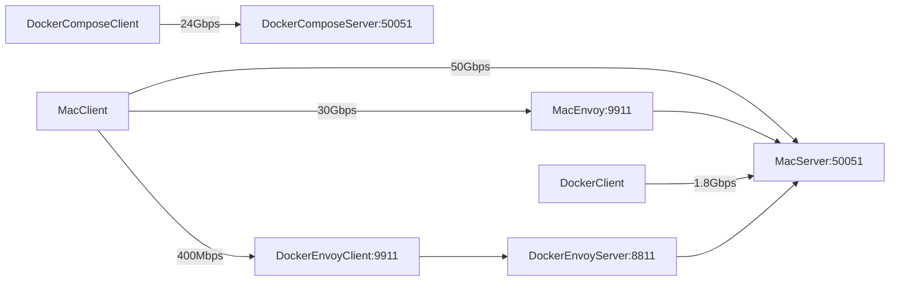
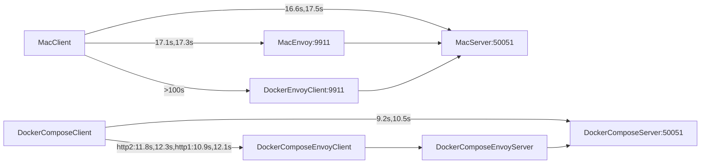

# envoy_profile


## 代理

```shell
export https_proxy="http://127.0.0.1:1080"
export http_proxy="http://127.0.0.1:1080"
```

## 测试：

1. 启动grpc server:
    `make grpc_server`
2. 启动envoy:
    - 方式1.直接使用mac envoy:
        make envoy_mac
    - 方式2.使用docker envoy:
        make envoy_docker
3. 测试grpc直连:
    make grpc_client
4. 测试envoy 代理：
    make envoy_client


## iperf



## timeconsume[unary,streaming]
500次调用，每次发10MB，分别采用unary,streaming


